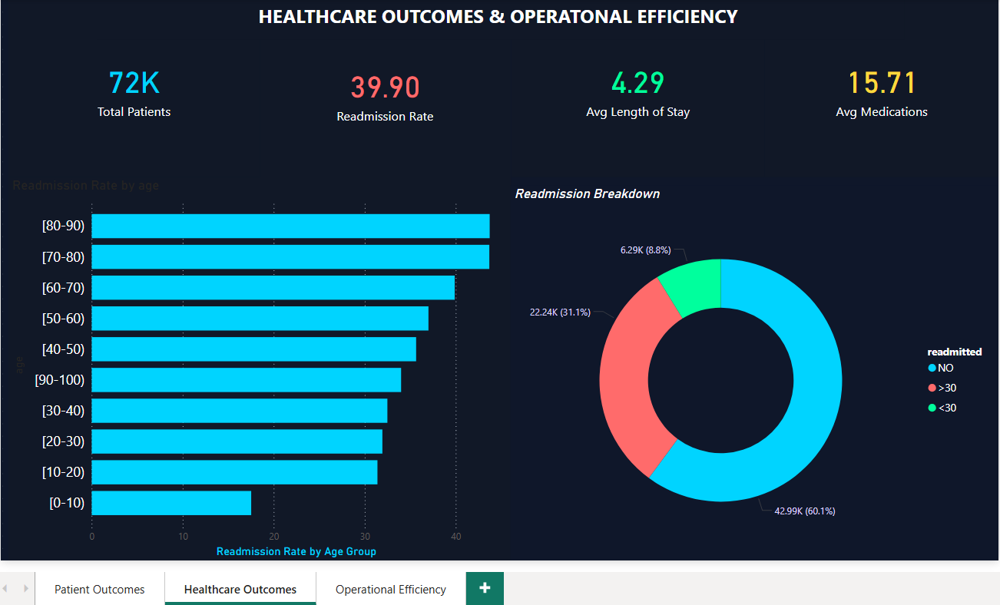
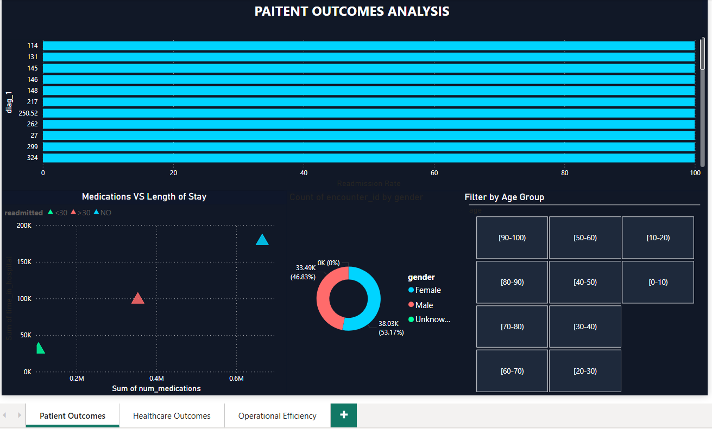
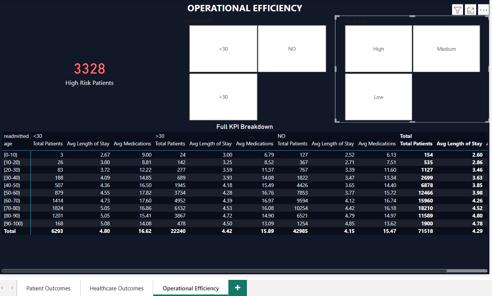
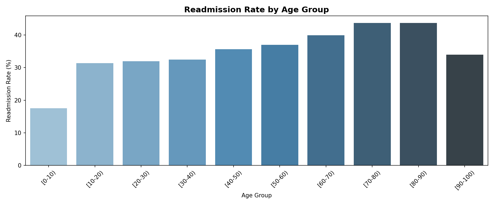
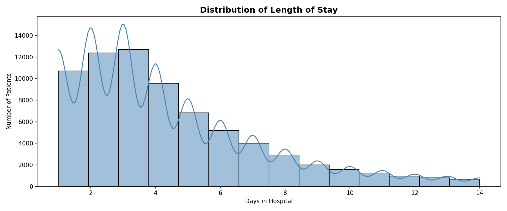
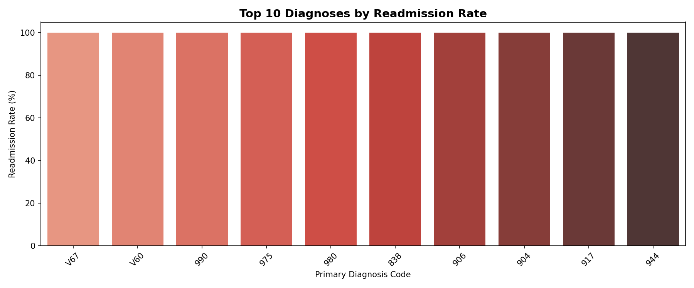
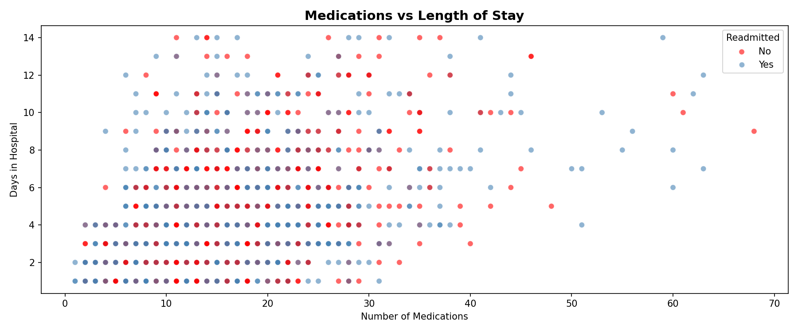
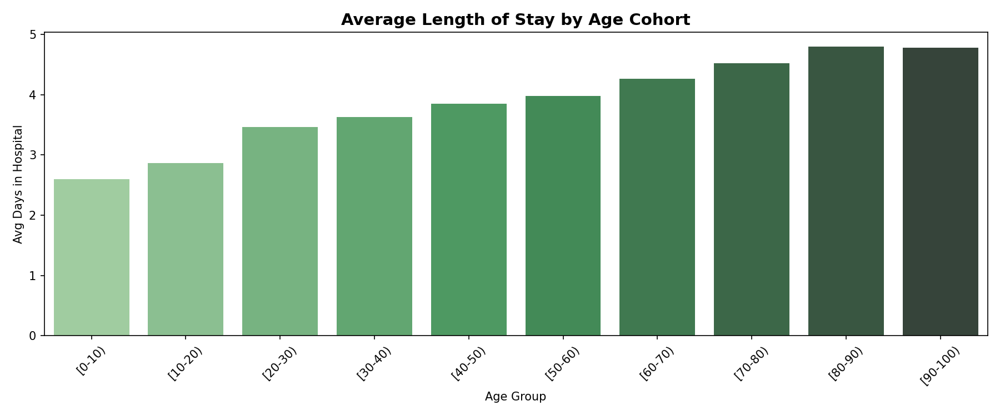

# 🏥 Healthcare Outcomes & Operational Efficiency Analytics

Analyzing 71,518 patient records from 130 US hospitals to uncover what drives readmissions, prolonged stays, and operational inefficiencies using Python, SQL, and Power BI.


## 🖥️ Dashboard Preview

<table>
  <tr>
    <td><b>💼 Power BI — Healthcare Outcomes</b><br></td>
    <td><b>💼 Power BI — Patient Outcomes</b><br></td>
  </tr>
  <tr>
    <td><b>💼 Power BI — Operational Efficiency</b><br></td>
    <td><b>📊 Python — Readmission by Age</b><br></td>
  </tr>
  <tr>
    <td><b>📊 Python — Length of Stay</b><br></td>
    <td><b>📊 Python — Top 10 Diagnoses</b><br></td>
  </tr>
  <tr>
    <td><b>📊 Python — Medications vs LOS</b><br></td>
    <td><b>📊 Python — Avg LOS by Age</b><br></td>
  </tr>
</table>


## 📊 Key Results At A Glance

| Metric | Result |
|--------|--------|
| 👥 Total Patients Analyzed | 71,518 |
| 🔄 Overall Readmission Rate | 39.9% |
| 🛏️ Average Length of Stay | 4.29 days |
| 💊 Average Medications | 15.71 per patient |
| ⚠️ Highest Risk Age Group | 70–80 years (43.9% readmission) |
| ⚠️ High Risk Patients | 3,328 |
| 🧪 Hypothesis Tests | 2 — both statistically significant |


## 🛠️ Tools & Technologies

| Tool | How I Used It |
|------|--------------|
| 🐍 Python | Data cleaning, EDA, cohort analysis, hypothesis testing |
| 🐼 Pandas | Data manipulation and transformation |
| 🔢 NumPy | Numerical operations |
| 📐 SciPy | Statistical hypothesis testing (t-tests) |
| 📊 Matplotlib & Seaborn | Data visualization |
| 🗄️ SQL (SQLite via Python) | Data modeling and querying |
| 💼 Power BI | Interactive business intelligence dashboard |
| ☁️ Google Colab | Cloud-based development environment |
| 🐙 GitHub | Version control and portfolio hosting |


## 🎯 Why I Built This

Hospital readmissions are one of the most expensive and preventable problems in healthcare. Every unnecessary readmission represents not just a cost to the system, but a failure in patient care. I wanted to understand what the data actually says — which patients are most at risk, what clinical factors contribute to longer stays, and where operational bottlenecks hide.

This project gave me the opportunity to work with a large, messy, real-world healthcare dataset and turn it into something that could genuinely inform decision-making.


## 📂 The Data

**Source:** Diabetes 130-US Hospitals (1999–2008) via UCI Machine Learning Repository / Kaggle

The dataset covers over 100,000 hospital encounters across 130 US hospitals over a 10-year period. After cleaning and deduplication, the working dataset contained **71,518 unique patient encounters** with information on:

- 👤 Patient demographics (age, gender, race)
- 🏨 Admission details and discharge dispositions
- 🩺 Primary, secondary, and tertiary diagnoses (ICD codes)
- 💊 Procedures, lab tests, and medications administered
- 🔄 Readmission outcomes (<30 days, >30 days, or none)


## 🔧 What I Did

### 🧹 Data Cleaning & Preparation
The raw data had a number of issues common in clinical datasets — missing values coded as `?`, duplicate patient records, and inconsistent formatting. I handled these systematically:

- Replaced `?` placeholders with proper null values
- Removed columns with excessive missingness (weight, payer code, medical specialty)
- Deduplicated records to retain only the first encounter per patient
- Created a binary readmission flag for downstream analysis

### 🔍 Exploratory Data Analysis
Once the data was clean, I explored it from multiple angles — looking at distributions, group comparisons, and correlations between clinical variables and outcomes. Some of the questions I explored:

- How does readmission rate vary across age groups?
- Which primary diagnoses are most associated with readmission?
- What does the distribution of hospital stays actually look like?
- Is there a relationship between medication count and length of stay?

### 👥 Cohort Analysis
I segmented patients into cohorts by age group and diagnosis risk level to compare outcomes across groups. This helped surface the fact that older patients (70–80) consistently showed higher readmission rates and longer stays, while younger patients recovered faster and were less likely to return.

### 🧪 Hypothesis Testing
I used independent samples t-tests to validate two key assumptions:

**Hypothesis 1:** Do patients with more diagnoses stay longer in hospital?
- ✅ Result: Statistically significant (p < 0.001)
- Patients in the high diagnosis group averaged 5.84 days vs 3.21 days for the low group

**Hypothesis 2:** Do readmitted patients receive more medications?
- ✅ Result: Statistically significant (p < 0.001)
- Readmitted patients averaged 16.8 medications vs 14.8 for non-readmitted patients

### 📈 Dashboards
I built two dashboards to make the findings accessible:

- **💼 Power BI Dashboard** — 3-page interactive report with KPI cards, bar charts, scatter plots, donut charts, slicers, and a full KPI breakdown matrix table
- **🌐 HTML Dashboard** — Custom-built interactive dashboard using Chart.js, accessible directly in any browser without any software


## 💡 Key Findings

**📈 Readmission Risk Increases with Age**
Patients in the 70–80 age group had the highest readmission rate at 43.9%, nearly 2.5x the rate of patients under 10. This points to a clear need for targeted post-discharge care management for elderly patients.

**🩺 Diagnosis Complexity Drives Longer Stays**
Patients with a high number of diagnoses (9+) stayed an average of 5.84 days compared to 3.21 days for patients with fewer diagnoses. This relationship was statistically significant and consistent across age groups.

**💊 Medication Load is a Readmission Signal**
Readmitted patients were prescribed significantly more medications on average. Whether this reflects higher disease complexity or medication management challenges is worth investigating further, but it suggests medication count could be a useful early warning indicator.

**🛏️ Most Patients Stay 1–4 Days**
The length of stay distribution was heavily right-skewed — the majority of patients were discharged within 4 days, but a meaningful tail of patients stayed 7+ days, representing the highest-cost and highest-risk segment.

**⚠️ Certain Diagnosis Codes Show 100% Readmission**
Some rare diagnosis codes (V67, V60, 990 etc.) showed 100% readmission rates, suggesting these represent specific patient pathways that may warrant dedicated care protocols.


## 📁 Project Structure
```
healthcare-analytics-portfolio/
├── 📂 data/
│   ├── diabetic_data.csv          # Original raw dataset
│   ├── diabetic_cleaned.csv       # Cleaned and deduplicated
│   └── cohort_summary.csv         # Cohort analysis output
├── 📂 python/
│   └── healthcare_analysis.ipynb  # Full analysis notebook
├── 📂 dashboard/
│   ├── healthcare_dashboard.pbix  # Power BI dashboard
│   └── healthcare_dashboard.html  # Interactive HTML dashboard
└── 📂 visuals/
    ├── Powerbi_Page1_Overview.png
    ├── Powerbi_Page2_Overview.png
    ├── Powerbi_Page3_Overview.png
    ├── readmission_by_age.png
    ├── length_of_stay.png
    ├── top_diagnoses_readmission.png
    ├── medications_vs_los.png
    └── avg_los_by_age.png
```

## ▶️ How to Run This Project

1. Clone this repository
2. Open `python/healthcare_analysis.ipynb` in Google Colab or Jupyter
3. Upload `data/diabetic_data.csv` when prompted
4. Run all cells in order
5. Open `dashboard/healthcare_dashboard.html` in any browser for the interactive dashboard

## 📝 What I Learned

Working through this project reinforced a few things for me. Real healthcare data is messy in ways that textbook datasets never are — duplicate records, missing values, inconsistent coding, and outliers that need to be understood rather than just removed. Getting the data right before doing any analysis is not a minor step, it is the foundation everything else is built on.

The statistical analysis also reminded me that not every pattern you see in a chart is meaningful. Running hypothesis tests to validate assumptions before drawing conclusions is what separates proper analysis from storytelling with numbers.

Finally, building the dashboards made it clear how important it is to design for your audience. The same insight lands very differently depending on whether it is presented as a raw table, a well-labelled chart, or an interactive drill-down that lets stakeholders explore it themselves.


## 📚 Dataset Citation

Strack, B., DeShazo, J.P., Gennings, C., Olmo, J.L., Ventura, S., Cios, K.J., Clore, J.N. (2014). Impact of HbA1c Measurement on Hospital Readmission Rates: Analysis of 70,000 Clinical Database Patient Records. BioMed Research International.


⭐ If you found this project useful or interesting, feel free to star the repository!
